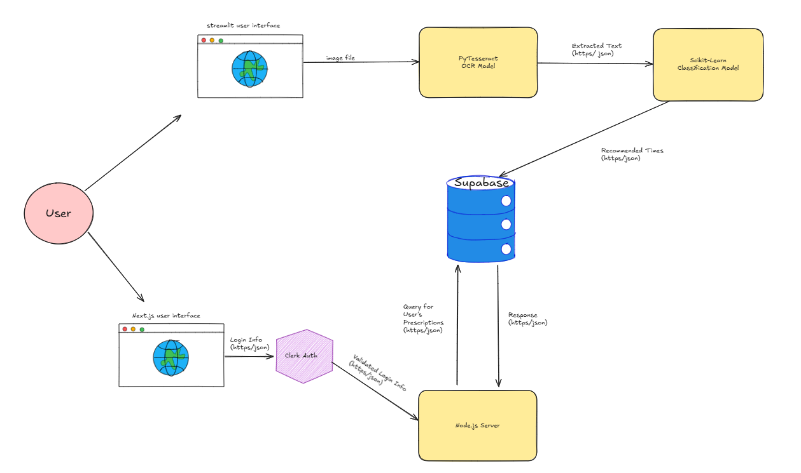
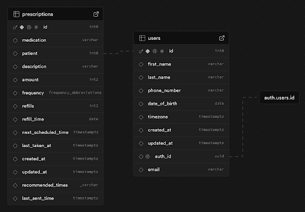
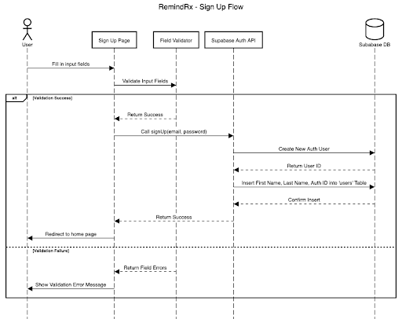

# RemindRX Architecture

This markdown documents the overall architecture of the RemindRX application

## High Level Component Diagram

Short Description: The streamlit UI inputs an image file and utilizes the OCR model to extract prescription information. This information serves as the input to the Scikit-Learn model that parses the information. Our model generates recommended times based on the medication frequency specified in the description and inserts into Supabase for future fetches. The Next.js UI (front end) allows the user to login and authorize their login credentials. Once authorized through the Node.js server, we can pull the user’s prescription info from Supabase.

## Entity/Relation Diagram

Short Description: Our system revolves around two primary tables. The User table stores personal information, enabling authentication and facilitating notifications for medication reminders. The Prescription table maintains comprehensive medication details, including drug names, descriptions, dosage frequency, refill information, recommended intake times, and more. By organizing this data, we ensure timely and accurate reminders based on prescription schedules and recommended times, ultiamtely helping users adhere to their prescribed treatment plans.

## Flow Diagram

Short Description: The user will input the fields to sign up (first name, last name, email, password, confirm password). The inputs will be validated and if successful, the Supabase API is called to create a new user instance. With the creation of a new user with the provided credentails, the user is sent to the home page. If the field validators returns a failure, the user is prevented from signing in with a validation exception.
