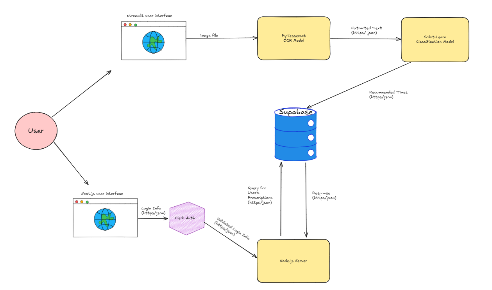
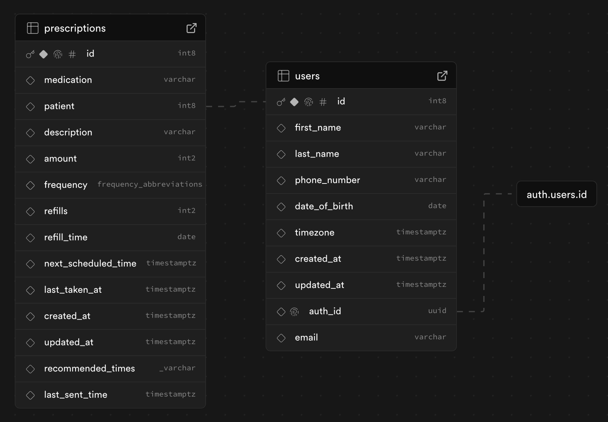

# RemindRX

## Component Diagram

A user entering our app has two options, they can scan in their prescriptions in the streamlit or they can view their upcoming prescriptions in nextjs. Discussing the streamlit, the user can drag and drop their prescription labels, then the ocr model can extract the text from the label, then the recommendation model recommends the best times to take a prescription. These recommendations then get stored inside our supabase database. For the nextjs app, we use clerk to handle logging in and signing up, then we query the database for the users' upcoming prescription and allow the user to check off the prescriptions they've taken so far. 
## ER Diagram

The basic ER Digram representing our two tables:
- the user table which is handling all users signed up on our app. the primary key is the user id which is generated on sign up.
- the prescription table which contains all prescriptions, scanned descriptions, recommended times to take, last time taken at, and next time to take. The foreign key is the patient which relies on users.id

We also have the auth user table, which is generated and handled by Clerk. The auth id generated by Clerk is then passed as a foreign key to users on users.auth_id

## Sequence Diagram

When the user opens the home page, the app fetches prescription data from the database. If the fetch is successful, the data is passed to the TimeOfDay (TOD) component, which filters prescriptions based on whether they should be taken in the morning, afternoon, or evening, and then renders a PillCard for each one. If the fetch fails, a Toast displays an error message. When a user checks the box next to a prescription, the PillCard component updates the last_time_taken field in the database. A Toast shows a success message if the update works, or a failure message if it doesn’t.