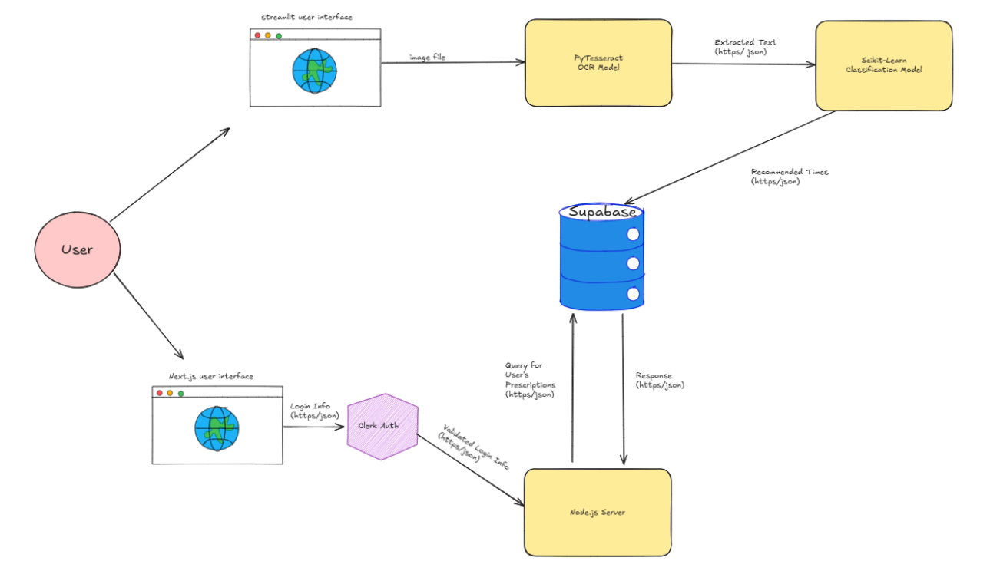
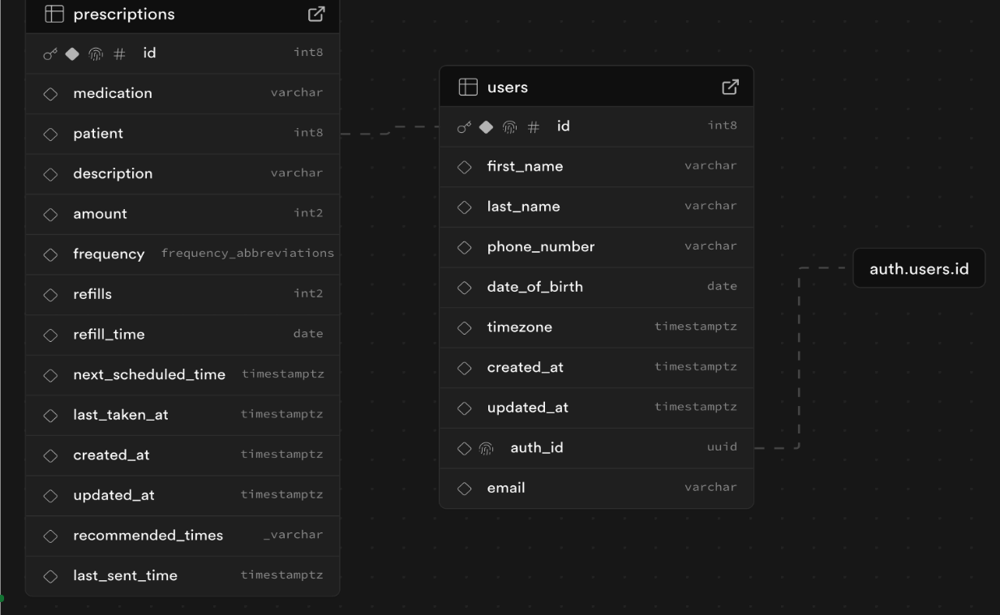
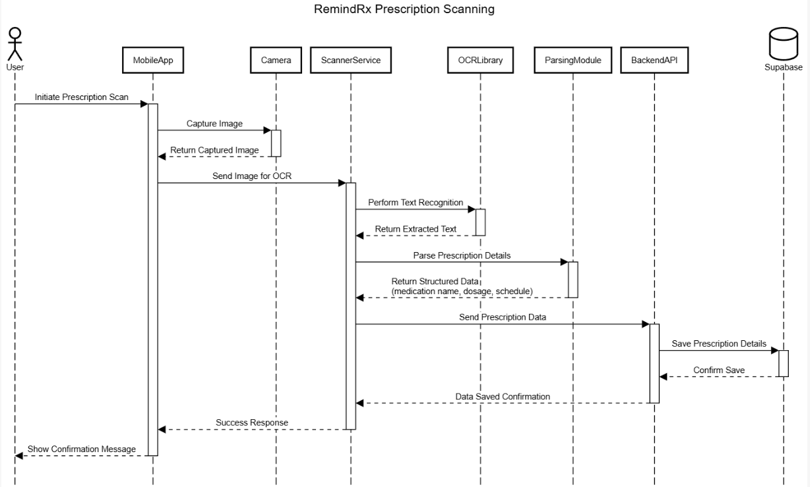

# System Architecture

## Pytesseract OCR Model

### High Level Component Diagram

This is a **system architecture diagram** showing how different components of the **RemindRx** ecosystem interact to scan prescriptions, classify them, and serve personalized data to the user.

### Flow Description:

1. **User Interaction**:
   - The user can interact through two interfaces:
     - A **Streamlit user interface** for uploading image files of prescriptions.
     - A **Next.js web interface** for logging in and managing prescription data.

2. **OCR & Classification Flow** (via Streamlit):
   - The user uploads an image file.
   - The image is sent to the **PyTesseract OCR Model**, which extracts text from the prescription.
   - The extracted text (in JSON) is passed to a **Scikit-Learn Classification Model**.
   - This model analyzes the data and returns **recommended medication times** (in JSON).
   - The results are stored in **Supabase**.

3. **Authentication & Data Retrieval Flow** (via Next.js):
   - User login info is sent from the **Next.js interface** to **Clerk Auth**.
   - **Clerk Auth** returns validated credentials to the **Node.js server**.
   - The server queries **Supabase** for the user’s prescription data.
   - Supabase returns the response (JSON), which is displayed in the Next.js UI.

### Key Components:
- **PyTesseract OCR Model**: Handles image-to-text conversion.
- **Scikit-Learn Model**: Classifies extracted text to recommend medication schedules.
- **Supabase**: Central database storing prescriptions and recommendations.
- **Clerk Auth**: Handles user authentication.
- **Node.js Server**: Acts as a backend orchestrator between the client and Supabase.

This diagram emphasizes the data flow between the frontend, backend, ML models, and storage, ensuring seamless user experience and prescription intelligence.

### Entity Diagram

This is an Entity-Relationship (ER) diagram for a prescription management system. It shows two main tables:

1. **`users` table** – Stores personal information about users such as:
   - `first_name`, `last_name`, `phone_number`
   - `date_of_birth`, `timezone`
   - `auth_id` (linked to an external authentication system)
   - Timestamps for creation and updates

2. **`prescriptions` table** – Tracks medication prescriptions with fields like:
   - `medication`, `description`, `amount`, and `frequency`
   - `refills`, `refill_time`, `next_scheduled_time`, and `last_taken_at`
   - Metadata like `created_at`, `updated_at`, and `last_sent_time`

The `patient` field in `prescriptions` is a foreign key referencing the `id` in the `users` table, establishing a one-to-many relationship (one user can have many prescriptions).

### Call Sequence Diagram

This is a **sequence diagram** for the **RemindRx Prescription Scanning** process. It illustrates how different components interact to scan, interpret, and store prescription data from a user's mobile device.

### Flow Description:

1. **User** initiates a prescription scan in the **MobileApp**.
2. The app uses the **Camera** to capture an image of the prescription.
3. The captured image is returned to the app and sent to the **ScannerService**.
4. The **ScannerService** forwards the image to an **OCRLibrary** to perform **text recognition**.
5. The **OCRLibrary** returns the extracted text to the **ScannerService**.
6. The text is passed to a **ParsingModule**, which extracts structured prescription data (e.g., medication name, dosage, and schedule).
7. This structured data is sent to the **BackendAPI**.
8. The **BackendAPI** stores the prescription details in **Supabase**.
9. Once saved, a confirmation is sent back through the chain.
10. The **MobileApp** displays a **confirmation message** to the user.

This diagram highlights the modular architecture and clear separation of responsibilities in the prescription scanning workflow.
