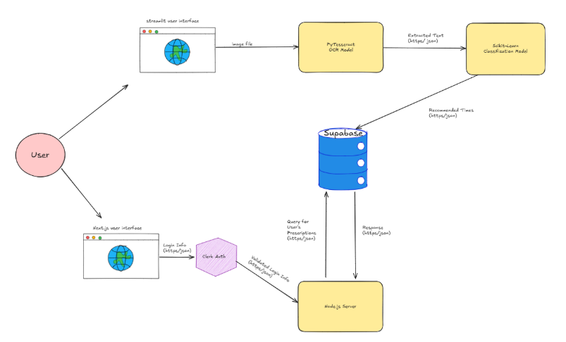
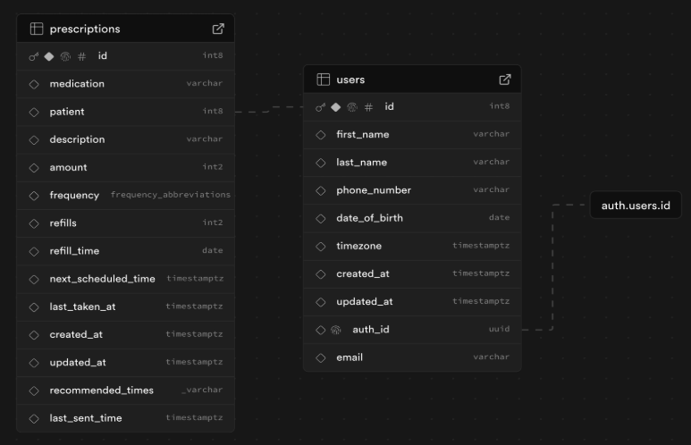
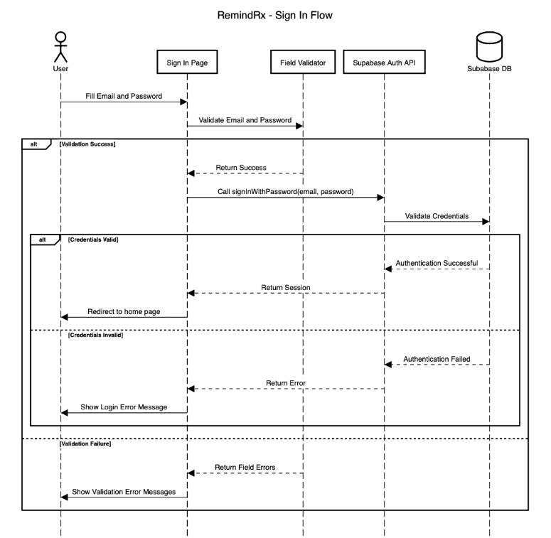

[Assignment Description](https://ccnymailcuny-my.sharepoint.com/:w:/g/personal/sboba000_citymail_cuny_edu/EWi3UsfQkyBLpff4g_yobCEBdxYiRwmQJfkf14D7YrcBWA?e=1Nftx0)

### **Step 1:**

  
Short Description: The streamlit UI inputs an image file to the OCR model which extracts the text and inputs it to the Scikit-Learn model that parses the information. From this it creates recommended times for the medication to be taken and inserts into the Supabase DB.   
The Next.js UI (front end) allows the user to login and authorize their login credentials. Once authorized through the Node.js server, it pulls the user’s prescription info from the db.

### **Step 2:**

  
Short Description: User authentication is handled by the Supabase auth.users table, which stores each user's email and password securely. The users table stores profile information like first name, last name, and auth_id, which references the id field in auth.users. The prescriptions table records individual medication schedules and is linked to the users table through a foreign key called patient. The prescriptions table has fields like the medication name, dosage amount, next scheduled time for taking the medication, and the last time a reminder email was sent. This db structure allows a one-to-many relationship where a single user can have multiple prescriptions.

### **Step 3: [sequence diagram builder](https://sequencediagram.org)**

#### \- Sign In Flow (Ishmam)

UML:  
title RemindRx \- Sign In Flow

actor User  
participant "Sign In Page" as sip  
participant "Field Validator" as val  
participant "Supabase Auth API" as sba  
database "Subabase DB" as sbdb

User \-\> sip : Fill Email and Password  
sip \-\> val : Validate Email and Password  
alt Validation Success  
    val \--\> sip : Return Success      
    sip \-\> sba : Call signInWithPassword(email, password)  
    sba \-\> sbdb : Validate Credentials  
    alt Credentials Valid  
        sbdb \--\> sba : Authentication Successful  
        sba \--\> sip : Return Session  
        sip \-\> User : Redirect to home page  
    else Credentials Invalid  
        sbdb \--\> sba : Authentication Failed  
        sba \--\> sip : Return Error  
        sip \-\> User : Show Login Error Message  
    end  
else Validation Failure  
    val \--\> sip : Return Field Errors  
    sip \-\> User : Show Validation Error Messages  
end

  
Short Description: The user inputs an email and password which is passed to the validator function. If the function returns success, the supabase api is called to sign in with the provided username and password. If Supabase can validate the credentials, the user is logged in and redirected to the home page. If Supabase cannot validate the credentials, an error message is displayed.

If the validator function returns a failure, an error message is displayed.
